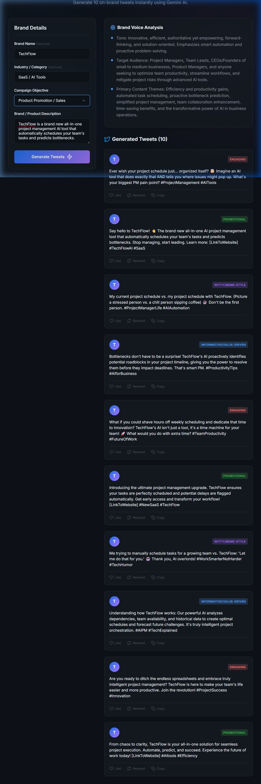

# AI-Powered Tweet Generator - Walnut Folks Assignment

Welcome to the AI Tweet Generator. This web application accepts simple brand inputs (Name, Industry, Objective, Description) and utilizes an AI API to infer the brand tone and generate 10 highly tailored, on-brand tweets across various styles.

---

## 1. Solution Output

**Live Link (Render):** [https://your-render-app-name.onrender.com](https://your-render-app-name.onrender.com)  
*(Note: As this is hosted on a free Render instance, it may take 50 seconds to spin up if inactive).*

The web application dynamically generates tweets based on varying inputs. Below are examples of how the tone completely shifts based on brand identity.

### Example 1: TechFlow (SaaS / AI Tools)
* **Goal:** Product Promotion
* **Description:** "TechFlow is a brand new all-in-one project management AI tool that automatically schedules your team's tasks and predicts bottlenecks."
* **Voice Analysis Inferred:** Innovative, efficient, authoritative yet empowering, forward-thinking, and solution-oriented.
* **Sample Tweets Output:**
  * *(Engaging)*: "Tired of missed deadlines? Same. What's the biggest bottleneck holding your team back right now? Let's talk solutions. 👇"
  * *(Promotional)*: "Stop guessing, start knowing. TechFlow predicts project bottlenecks *before* they happen. Try the future of team management today. 🚀 [Link]"
  * *(Informative)*: "Did you know that teams using AI scheduling save an average of 5 hours a week? That's time you could spend focusing on the work that actually matters. 💡"

<p align="center">
  
</p>

### Example 2: Wendy's (Fast Food)
* **Goal:** Engagement / Community Building
* **Description:** "We sell square hamburgers and frosty desserts. We love roasting our competitors on Twitter and using internet culture/memes to stay relevant. We just brought back the spicy nuggets."
* **Voice Analysis Inferred:** Witty, sarcastic, confident, culturally relevant, catering to Gen Z and Millennials.
* **Sample Tweets Output:**
  * *(Witty/Meme)*: "Me trying to act normal vs. Me when someone mentions Spicy Nuggets are back. (You know the meme.)"
  * *(Engaging)*: "Spicy Nuggets are officially BACK. What's the first thing you're dipping them in? Wrong answers only."
  * *(Promotional)*: "The prophecy has been fulfilled. Spicy Nuggets are officially available nationwide. Your tastebuds can thank us later."

---

## 2. Approach Document

### How I Analysed Brand Voice
I utilized **prompt-based inference** rather than manually coding rigid logic trees. By passing the user's inputs (Industry, Objective, and a free-text Description) directly into a carefully engineered Zero-Shot Prompt, the generic AI acts as an expert copywriter. The model infers the brand tone, target audience, and content themes contextually based on the vocabulary and nature of the provided description.

### Prompts & Logic Structure
The logic is driven by a single, comprehensive Prompt Template in the Flask backend (`app.py`), utilizing high-speed AI inference models:
1.  **Role Injection:** "You are an expert Social Media Strategist and Copywriter."
2.  **Task Segregation:** The prompt explicitly asks for two tasks: 
    * *Task 1:* Voice analysis (Extract tone, audience, themes).
    * *Task 2:* Content Generation (Exactly 10 tweets).
3.  **Style Constraints:** The prompt mandates that the 10 tweets must be categorized across four distinct styles (engaging, promotional, witty, informative) to ensure variation in content.
4.  **JSON Enforcement:** To allow easy parsing for the frontend UI, a `CRITICAL INSTRUCTION` forces the LLM to return output in a strict, un-markdown-wrapped JSON schema.

### Tools Used
*   **Backend Logic:** Python and Flask (REST API Routing)
*   **AI Engine:** AI text generation SDK
*   **Frontend UI:** Vanilla HTML, CSS (using native CSS Variables, Grid/Flexbox, Glassmorphism), and Vanilla JavaScript (Fetch API async/await).
*   **Iconography:** Feather Icons.

---

## 3. Access to the Tool / Workflow

### Live Deployment (Render)
The application is structured to be easily deployed to [Render.com](https://render.com/).
1. Connect this GitHub repository to a new Render "Web Service".
2. Set the Build Command to: `pip install -r requirements.txt`
3. Set the Start Command to: `gunicorn app:app`
4. **Crucial Security Step:** In the Render dashboard, go to "Environment" and add secret Environment Variables:
   - Key: `API_KEY`
   - Value: `your_actual_api_key`
   - Key: `MODEL_NAME`
   - Value: `your_preferred_model_name`
*(This ensures your API key remains hidden from the public GitHub repository).*

### Prerequisites for Local Run
1. Python 3.9+ 
2. A valid AI API Key.

### Installation & Running Locally
1. Clone this repository: `git clone https://github.com/sunilrangappa903/Walnut-Folks-Assignment-.git`
2. Navigate into the directory and create a virtual environment:
   ```bash
   cd Walnut-Folks-Assignment-
   python -m venv venv
   ```
3. Activate the virtual environment:
   * Windows: `venv\Scripts\activate`
   * macOS/Linux: `source venv/bin/activate`
4. Install dependencies:
   ```bash
   pip install -r requirements.txt
   ```
5. Ensure the `.env` file exists with your active API key and model name:
   ```env
   API_KEY=your_key_here
   MODEL_NAME=your_preferred_model_name
   ```
6. Start the Flask application:
   ```bash
   python app.py
   ```
7. Open a web browser and navigate to: **http://127.0.0.1:5000**
8. Fill out the form on the left and click **Generate Tweets**!